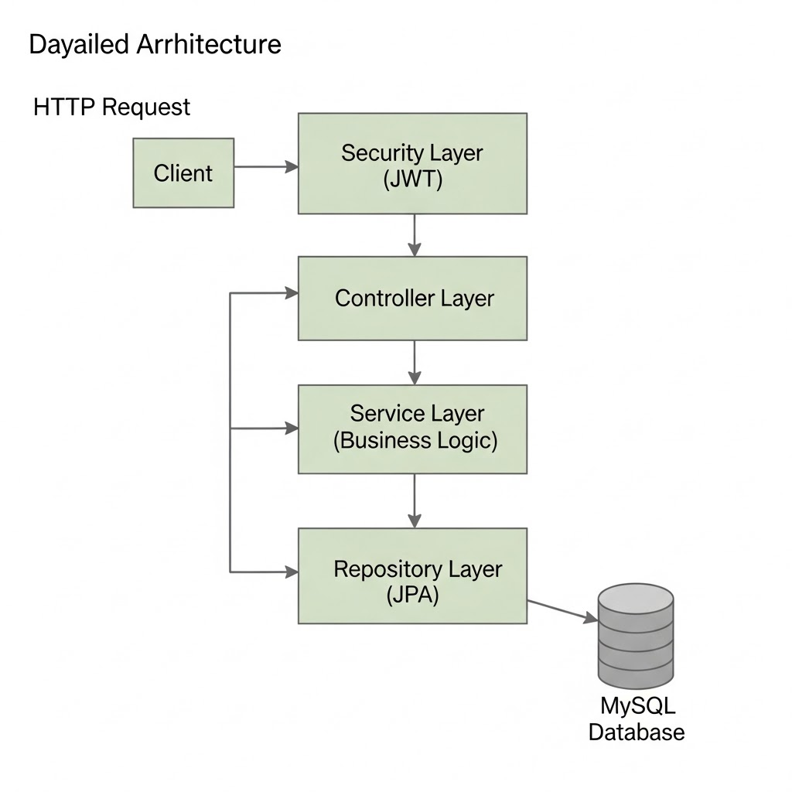
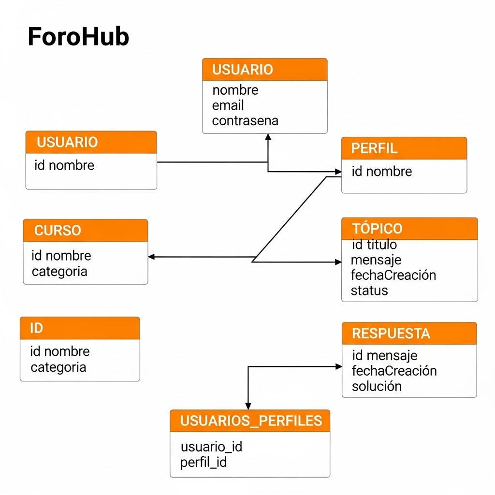

<div align="center">
  <h1 align="center">
    <br />
    <br />
    <a href="https://[24kuant.github.io/challenge-amigo-secreto](https://github.com/24Kuant/forohub)/">
      
    </a>
  </h1>
</div>

# 📚 ForoHub


API REST para un sistema de foro, desarrollada como parte del Challenge de Alura Latam. Permite a los usuarios registrarse, crear tópicos de discusión, publicar respuestas y gestionar cursos.
*ForoHub* es una plataforma backend desarrollada con **Spring Boot 3**, **Spring Security**, **JWT**, **Java 21** y **JPA/Hibernate**. 
El proyecto sigue una arquitectura limpia y modular, asegurando mantenibilidad y escalabilidad.

---

## ✨ Características principales

* 🔒 **Autenticación y Autorización** mediante JWT (Bearer Token).
* 👥 **Gestión de Usuarios y Perfiles** con roles y permisos.
* 📝 **Módulo de Tópicos y Respuestas** estilo foro comunitario.
* 🎓 **Administración de Cursos** asociados a usuarios y temas.
* 📜 **Swagger/OpenAPI** para documentación interactiva de la API.
* 🗄️ **Persistencia con JPA/Hibernate** sobre **MySQL** (H2 para pruebas).
* 🚀 **Arquitectura modular** con separación clara en `controller`, `domain` e `infra`.

---

## 🏛️ Arquitectura

La arquitectura de ForoHub se organiza en **tres capas principales**:

* **Controller** → Expone endpoints REST.
* **Domain** → Contiene entidades, DTOs, servicios y repositorios.
* **Infra** → Configuración de seguridad, manejo de errores y utilidades.



---

## 🏛️ Base de Datos

el diagrama Entidad Relación de ForoHub se organiza en **cinco tablas principales**:

Descripción de las Relaciones
* 📜 **Usuario** y **Perfil** (Muchos a Muchos): Un usuario puede tener múltiples perfiles y un perfil puede ser asignado a múltiples usuarios. Esto se gestiona a través de la tabla usuarios_perfiles.
* 🔒 **Usuario** y **Tópico** (Uno a Muchos): Un usuario puede crear muchos tópicos.
* 👥 **Usuario** y **Respuesta** (Uno a Muchos): Un usuario puede escribir muchas respuestas.
* 🎓 **Curso** y **Tópico** (Uno a Muchos): Un curso puede tener muchos tópicos asociados.
* 🔑 **Tópico** y **Respuesta** (Uno a Muchos): Un tópico puede tener muchas respuestas.



---

## 🛠️ Tecnologías utilizadas

* **Java 17**
* **Spring Boot 3**
* **Spring Security 6 + JWT**
* **Spring Data JPA (Hibernate)**
* **MySQL / H2** (dependiendo del perfil)
* **Swagger / OpenAPI 3**
* **Maven** como gestor de dependencias

---


### 2️⃣ Configurar base de datos

Editar `application.properties` o `application.yml` en `src/main/resources/`:

```properties
spring.datasource.url=jdbc:mysql://localhost:3306/forohub
spring.datasource.username=usuario
spring.datasource.password=contraseña
```

### 3️⃣ Compilar y ejecutar

```bash
mvn clean install
mvn spring-boot:run
```

### 4️⃣ Acceder a la API

* Swagger UI: [http://localhost:8080/swagger-ui.html](http://localhost:8080/swagger-ui.html)
* API Base: `http://localhost:8080`

---

## 📖 Endpoints principales

### 🔑 Autenticación

* `POST /auth/login` → Genera un token JWT.

### 👤 Usuarios

* `POST /usuarios` → Registrar usuario.
* `GET /usuarios` → Listar usuarios.
* `PUT /usuarios` → Actualizar usuario.
* `DELETE /usuarios/{id}` → Eliminar (borrado lógico).

### 📚 Cursos

* `POST /cursos` → Registrar curso.
* `GET /cursos` → Listar cursos.

### 🗨️ Tópicos

* `POST /topicos` → Crear nuevo tópico.
* `GET /topicos` → Listar tópicos.

### 💬 Respuestas

* `POST /respuestas` → Agregar respuesta.
* `GET /respuestas` → Listar respuestas.

---

## 🔐 Seguridad JWT

* Autenticación vía `POST /auth/login` con credenciales.
* Respuesta incluye un **Bearer Token**.
* Todas las demás peticiones requieren el header:

```http
Authorization: Bearer <token>
```

---

## 👨‍💻 Contribución

1. Haz un fork del repositorio.
2. Crea una rama para tu feature (`git checkout -b feature/nueva-funcionalidad`).
3. Realiza tus cambios y haz commit (`git commit -m 'Agregada nueva funcionalidad'`).
4. Haz push a la rama (`git push origin feature/nueva-funcionalidad`).
5. Abre un Pull Request 🚀.

---

## 📜 Licencia

Este proyecto está bajo la licencia **MIT**. Consulta el archivo [LICENSE](LICENSE) para más información.

# foro-club
